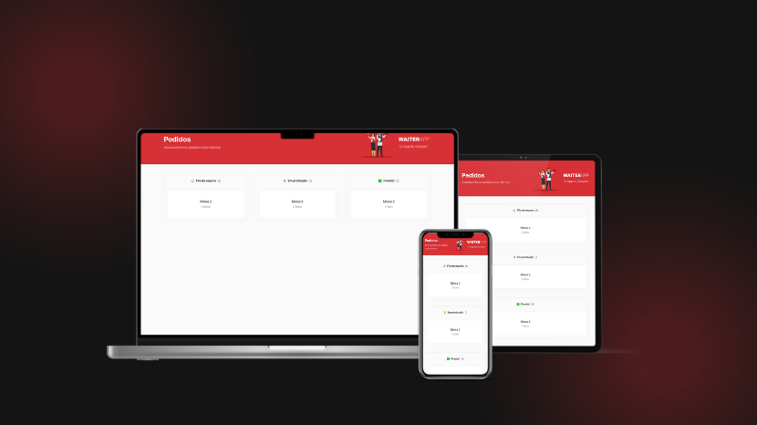

<p align="center">
  
</p>

<p align="center">
  

  

  
</p>

<h1 align="center">
    Waiter App API
</h1>

<br>

## 🧪 Technologies

This project was developed using the following technologies:

- [Node.Js](https://nodejs.org/en)
- [Express.Js](https://expressjs.com/)
- [Multer](https://www.npmjs.com/package/multer)
- [TypeScript](https://www.typescriptlang.org/)
- [Mongoose](https://mongoosejs.com/)
- [Dotenv](https://www.npmjs.com/package/dotenv)

## 🚀 Getting started

Clone the project and access the folder.

```bash
git clone https://github.com/Robson-Carvalho/waiter-app-api.git
cd waiter-app-api
```

Run this command to install the dependencies.

```bash
npm install
```

```
npm start
```

## 📖 Description

The Waiter-App-API is an API developed in Node.js that was created to manage the ordering process in a restaurant. The purpose of the API is to provide an easy-to-use interface for customers to place orders and for restaurant staff to manage those orders.

The API was built using the Express.js framework, which is a popular choice for building APIs in Node.js. In addition, the API uses the MongoDB database to store order information.

## 📝 License

This project is licensed under the MIT License. See the [LICENSE](./LICENSE.md) file for details.

---

Made with 💜 by [Robson Carvalho](https://portfolio-robson-carvalho.vercel.app/) 👋
